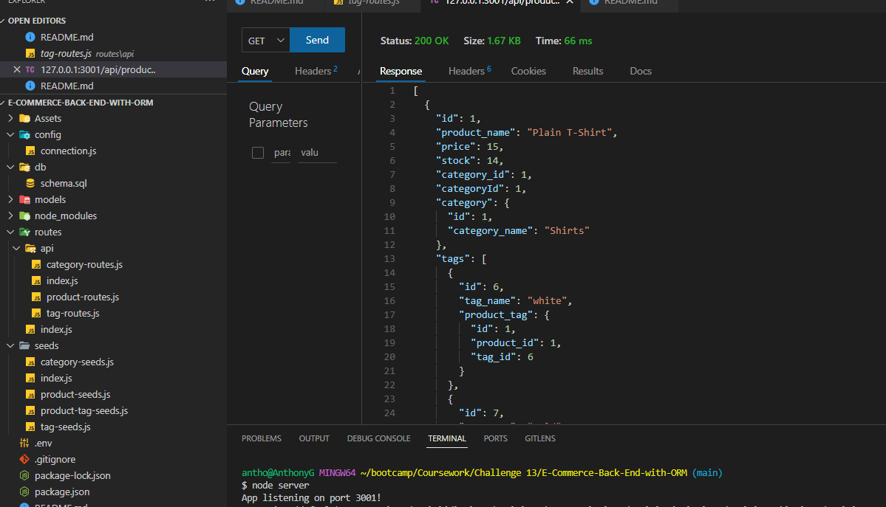

# E-Commerce-Back-End-with-ORM

Back-End of an e-commerce website which was built using latest technologies.

# Carleton University Coding Bootcamp Challenge 

## Bootcamp Module 13 Individual Challenge Assignment - E-Commerce-Back-End-with-ORM

Back-End of an e-commerce website which was built using latest technologies. This website is suitable for small-medium enterprise to enhance the business to the latest trading trends and to be potentially competitive in the online market.

## User Acceptance Criteria

* Ability to add the database name, MySQL username, and MySQL password to an environment variable file to be connected to a database using Sequelize
* Facilitate entering schema and seed commands to create a database and the related data seeds.
* When the server is started the application the Sequelize models are synced to the MySQL database.
* When the API GET routes are opened in Insomnia for categories, products, or tags, then the data for each of these routes is displayed in a formatted JSON. 
* Ability to test API POST, PUT, and DELETE routes in Insomnia for the purpose of create, update, and delete data in my database.

## Requirements to run the code and to get the outputs

- VS Code with MYSQL Express JS, node js and the NPM packages: express, mysql2, equelize and dotenv.
- OS - MS Windows, MAC or any other OS which supports GUI browser display.

## Usage

Screen layout is available in the repository path: 

## Credits

- Lecturers: Gurneesh Singh, Laura Cole and Dani Chankhour for teaching us the modules.
- Tutor Dru Sanchez for guiding me on the module.

  
## Features Links

- Application vedio demo URL: https://drive.google.com/file/d/13Jsa807y9AF1jukNLT6WYE2nnaV8SNfT/view
- Github Repository url: https://github.com/anthogr45/E-Commerce-Back-End-with-ORM